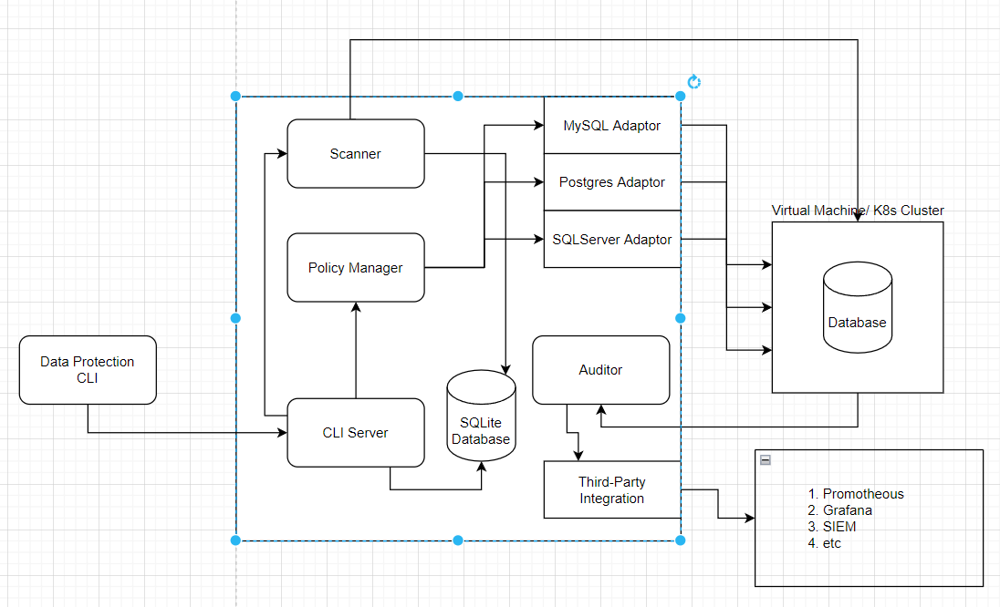

# Introduction to DataSage

DataSage.io is a cloud data classification and tracking product that allows enterprises to implement governance, risk, and compliance. It works on MySQL Databases at this moment of time and is database specific.

Enterprise data environments are increasingly complex. Data is spread across multiple different environments with multiple personas accessing the data. It is becoming increasingly difficult, if not impossible to Provide continuous visibility on data access or preventing data breaches.

DataSage is an open source tool that solves these problems by enabling the following features:

1. Data Protection ,the system will identify all the data sources available and provides unprecedented “unified” visibility and policy based access control to all the data sources.

2. Data classification. Data sage provides unprecedented visibility through automated data classification of known types of data (that have been defined with metadata) across all the databases it has been tracking.

3. Data audit: DataSage provides continuous visibility and policy based data governance through a data policy operator.

## Architecture Diagram:

## How does it work?

DataSage does not attempt to intercept your database connections, nor requires you to rewrite connections through custom database drivers. Instead, DataSage uses database specific audit logging features to intercept database audit logs and parse fields, and meta data to:

1. Identify sensitive data as defined by sensitive class meta data

2. Identify audit log / policy violations based on policies created against sensitive classes and sensitive tags.

## Functionality:

- Enforce security policies to a particular column in the Database using mapped sensitive tags and class. 

- Policies will be made and applied , accordingly there are certain actions with policy for specific sensitive tags or classes like allow read , allow write, deny read etc.

- Produce alerts and system logs, they generate alerts and system logs based on system metadata

## Getting Started:

> Deployment Steps:

- How to Deploy DataSage

- How add a Datasource (MySQL)

- How to add class

- How to add tags

- How to apply Policy

- How to view Logs

## Community:

> ### Slack : 

Please join the [DataSage Slack channel](datasage-workspace.slack.com) to communicate with DataSage community. We always welcome having a discussion about the problems that you face during the use of DataSage.

## License:
DataSage is licensed under the Apache License, Version 2.0
